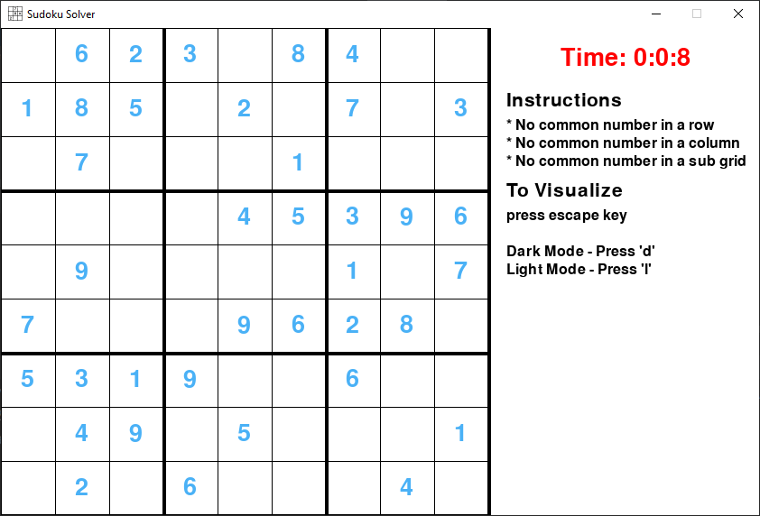
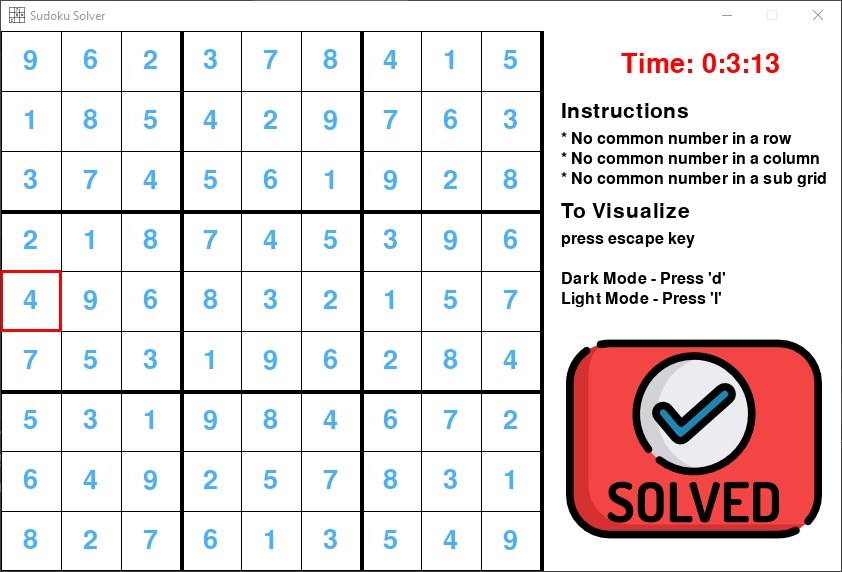
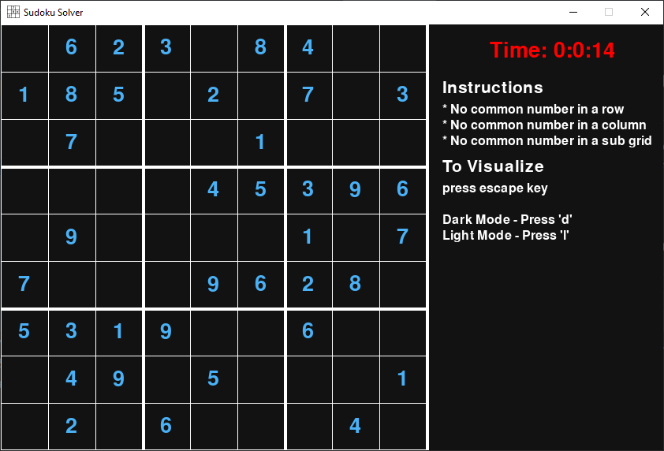
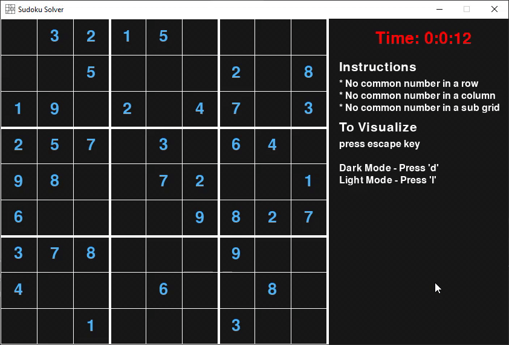

# Sudoku Solver and Visualizer 
A Visualizer to view the backtracking approach used to solve the sudoku problem and also works as a sudoku game

## Project Information
* This Visualizer is developed completed in python
* Interface is implemented using pygame

## Screenshots
Here are some of the screenshots of Sudoku Visualizer

#### Dark Mode

## Visualization Demo
Here  is a short visualization demo
